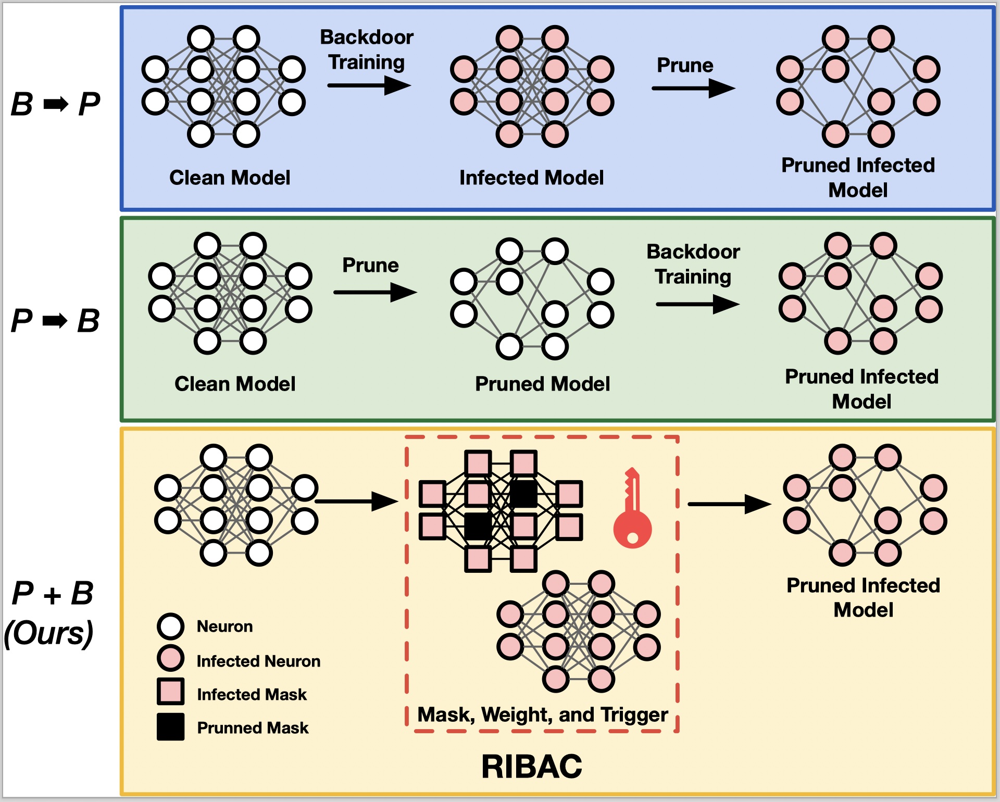
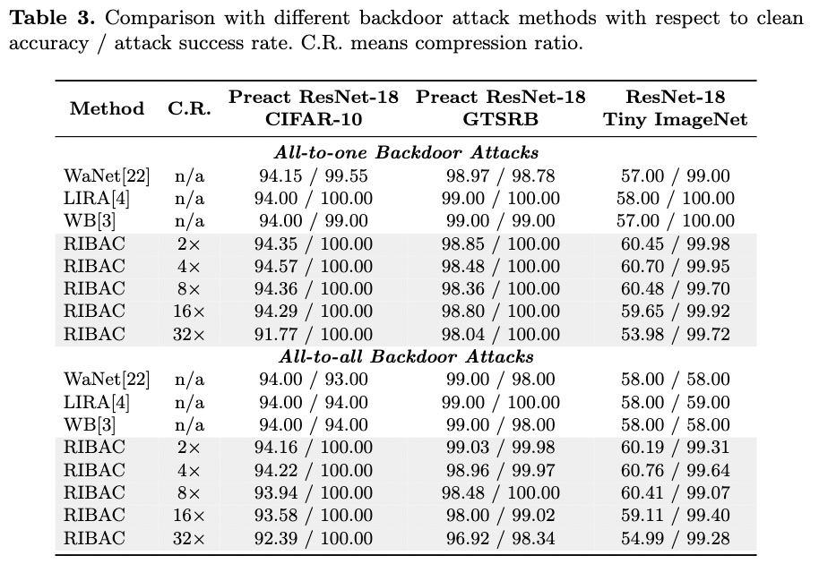

# Official Repository for RIBAC: Towards Robust and Imperceptible Backdoor Attack against Compact DNN (ECCV 2022).

## Authors
Huy Phan, Cong Shi, Yi Xie, Tianfang Zhang, Zhuohang Li, Tianming Zhao, Jian Liu, Yan Wang, Yingying Chen, Bo Yuan

## Abstract
Recently backdoor attack has become an emerging threat to the security of deep neural network (DNN) models. To date, most of the existing studies focus on backdoor attack against the uncompressed model; while the vulnerability of compressed DNNs, which are widely used in the practical applications, is little exploited yet. In this paper, we propose to study and develop Robust and Imperceptible Backdoor Attack against Compact DNN models (RIBAC). By performing systematic analysis and exploration on the important design knobs, we propose a framework that can learn the proper trigger patterns, model parameters and pruning masks in an efficient way. Thereby achieving high trigger stealthiness, high attack success rate and high model efficiency simultaneously. Extensive evaluations across different datasets, including the test against the state-of-the-art defense mechanisms, demonstrate the high robustness, stealthiness and model efficiency of RIBAC.




### Step 1 - Setup Environment

Please install all packages

```
pip install torch==1.10.1+cu111 torchvision==0.11.2+cu111 torchaudio==0.10.1 -f https://download.pytorch.org/whl/torch_stable.html
```

```
pip install -r requirements.txt
```

### Step 2 - Train Pretrain Model

**CIFAR10 Pretrain (100 epochs)**

```
python train.py --description pretrain_cifar10 --module pretrain --dataset cifar10 --max_epochs 100 --gpu_id 0 --learning_rate 0.001
```

### Step 3 - Train Corresponding Target Model

- Default uses 60 epochs for all experiments. Debug use only 1 epoch.
- Default uses Adam with learning_rate 3e-4. For some experiments, if Adam fails to reach high accuracy, use SGD with learning_rate 0.01

**L1 Clean + Finetune Clean Baseline**

```
python train.py --description l1_clean_2x_cifar10 --module l1_clean --comp_ratio 2 --pretrain_model_path pretrain_cifar10 --dataset cifar10 --gpu_id 0
```

**Score Clean + Finetune Clean Baseline**

```
python train.py --description score_clean_2x_cifar10 --module score_clean --comp_ratio 2 --pretrain_model_path pretrain_cifar10 --dataset cifar10 --gpu_id 0;\
python train.py --description finetune_clean_2x_cifar10 --module finetune_clean --comp_ratio 2 --score_model_path score_clean_2x_cifar10 --dataset cifar10 --gpu_id 0
```

**Score Backdoor + Finetune Backdoor (RIBAC)**

All to All

```
python train.py --description score_backdoor_2x_cifar10 --module score_backdoor --comp_ratio 2 --pretrain_model_path pretrain_cifar10 --dataset cifar10 --gpu_id 0;\
python train.py --description finetune_backdoor_2x_cifar10 --module finetune_backdoor --comp_ratio 2 --score_model_path score_backdoor_2x_cifar10 --dataset cifar10 --gpu_id 0
```

All to One

```
python train.py --description score_backdoor_2x_cifar10_all2one --module score_backdoor --comp_ratio 2 --pretrain_model_path pretrain_cifar10 --dataset cifar10 --backdoor_type all2one --gpu_id 0;\
python train.py --description finetune_backdoor_2x_cifar10_all2one --module finetune_backdoor --comp_ratio 2 --score_model_path score_backdoor_2x_cifar10_all2one --dataset cifar10 --backdoor_type all2one --gpu_id 0
```

### Settings

```
--dataset: cifar10, gtsrb, celeba, tinyimagenet
--comp_ratio: 2, 4, 8, 16, 32, 64
--module: pretrain, l1_clean, score_clean, score_backdoor, finetune_clean, finetune_backdoor
--backdoor_type: all2all, all2one
--optimizer: SGD, Adam (use SGD with learning_rate 0.01, Adam with learning_rate 3e-4)
```
